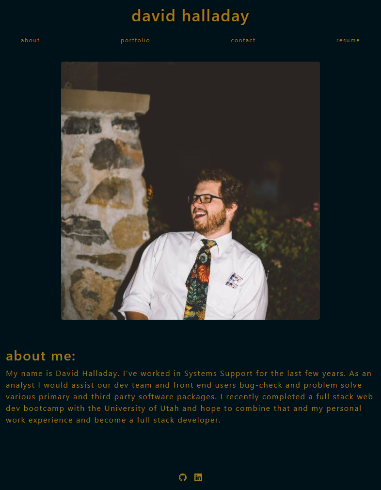

# React Portfolio

Created a Web Portfolio for current and future projects

## Purpose

In order to become more competitive as a full stack developer, it is important to have a portfolio where your best work and skills can be put on display for future employers to review. This project was to create a page where I can showcase my coding abilities and future projects as I continue to learn and improve.

You can contact me by filling out the contact form!

## Made with:

- HTML
- CSS
- Javascript
- React
- React Bootstrap
- EmailJS

## Website

https://dhalladay.github.io/first-react-portfolio/

## Usage

Can be accessed by using the link about in any standard browsers. 

## Contributions

Original code by Dave Halladay
